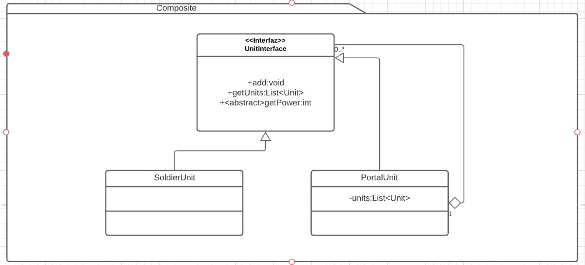

# Composite
Es un patrón estructural. [Link descripción](https://www.tutorialspoint.com/design_pattern/composite_pattern.htm)

Este patrón se basado en una estructura de Arbol se utiliza para componer funcionalidad entre los nodos y hojas siendo transparente para el cliente el conocer la estructura interna del arbol.

## Diagrama de clases

## SOLID

* Single responsibility

El composite tiene la responsabilidad de realizar una acción compuesta del propio componente y sus hijos.

* Open/Closed principle

Siempre se pueden implementar nuevas clases que hereden del compisite abstracto por lo que nueva funcionalidad podría ser agregada simplemente heredando.

* Liskov substitution

Por naturaleza los composite pueden ser intercambiados y siempre deberían comportarse como el padre de la jerarquia.

* Interface segregation

Composite tiende a romper este principio ya que el manejo de composición entre nodos y hojas hace que la funcionalidad de agregar o listar dependencias este declarada en la superinterfaz, por lo que se rompe con este principio

* Dependency inversion

No hay razón para que los composite dependan de implementaciones concretas, siempre pueden referenciar a la interfaz abstracta padre.

